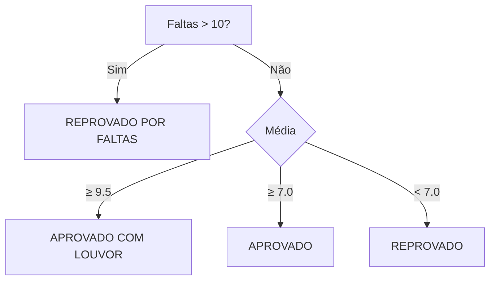

# Questão 404 - Classificação de Alunos (Escola de Música)

## Descrição
Classifique alunos.

## Solução em C
```c
#include <stdio.h>

const char* ClassificaAluno(float media, int faltas) {
    if (faltas > 10) {
        return "REPROVADO POR FALTAS";
    } else {
        if (media >= 9.5) {
            return "APROVADO COM LOUVOR";
        } else if (media >= 7) {
            return "APROVADO";
        } else {
            return "REPROVADO";
        }
    }
}

int main() {
    float media;
    int faltas;
    scanf("%f %d", &media, &faltas);
    printf("%s\n", ClassificaAluno(media, faltas));
    return 0;
}
```

## Fluxo de Decisão


## Casos de Teste
| Média | Faltas | Saída               |
|-------|--------|---------------------|
| 9.8   | 5      | APROVADO COM LOUVOR |
| 7.5   | 12     | REPROVADO POR FALTAS|
| 6.9   | 3      | REPROVADO           |
