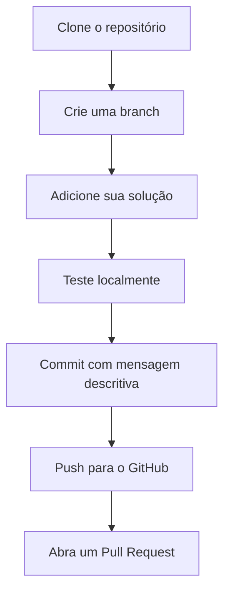

# The Huxley Solutions 🧠💻

## 🔄 Fluxo de Contribuição



[](LICENSE)
[](https://github.com/brunomalta04/the-huxley-solutions/commits/main)

Repositório organizado de soluções para problemas do [The Huxley](https://www.thehuxley.com/).

## 📂 Estrutura Completa

| Diretório       | Descrição                                                                 | Exemplo Típico                  |
|-----------------|---------------------------------------------------------------------------|----------------------------------|
| `Array/`        | Operações com vetores unidimensionais                                    | Busca, ordenação, filtragem     |
| `Funcao/`       | Problemas resolvidos com funções auxiliares                              | Modularização de código         |
| `Matriz/`       | Soluções envolvendo arrays bidimensionais                                | Operações matriciais            |
| `Recursao/`     | Implementações usando recursão                                           | Fatorial, Fibonacci, divisão-e-conquista |
| `Decisao/`      | Problemas baseados em estruturas condicionais                            | Classificações, validações      |
| `Repeticao/`    | Soluções com estruturas de repetição                                     | Séries numéricas, padrões       |
| `Outras/`       | Casos especiais e problemas miscelâneos                                  | Conversão de bases, jogos       |

### Organização dos Arquivos
Cada solução inclui:
- Código comentado
- Exemplos de entrada/saída

## 🚀 Como Usar

1. Clone o repositório:
```bash
git clone https://github.com/bruno/the-huxley-solutions.git