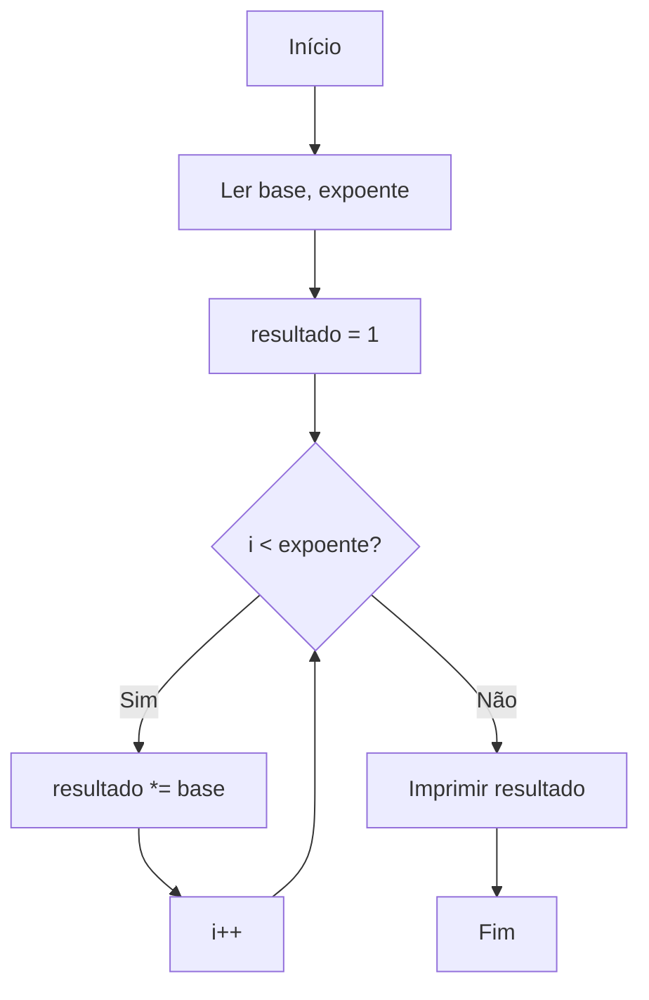

# Questão 902 - Base e Expoente 🔢➗

<div style="background: #f0f8ff; padding: 12px; border-radius: 8px; border-left: 4px solid #4682b4; margin-bottom: 16px; font-family: Arial, sans-serif;">

[**🔍 Descrição**](https://github.com/brunomalta04/the-huxley-solutions/blob/main/repeticao/questao_902.md#descrição)  
Calcula potências usando repetição. Implementa a lógica:  
```math
\text{resultado} = \text{base}^{\text{expoente}}
```

[**💻 Solução em C**](https://github.com/brunomalta04/the-huxley-solutions/blob/main/repeticao/questao_902.md#solução-em-c)  
```c
#include <stdio.h>

int main() {
    int base, expoente, resultado = 1;
    
    printf("Digite a base e expoente: ");
    scanf("%d %d", &base, &expoente);

    for(int i = 0; i < expoente; i++) 
        resultado *= base;

    printf("Resultado: %d\n", resultado);
    return 0;
}
```

[**📊 Fluxo do Algoritmo**](https://github.com/brunomalta04/the-huxley-solutions/blob/main/repeticao/questao_902.md#fluxo)  


[**📝 Explicação**](https://github.com/brunomalta04/the-huxley-solutions/blob/main/repeticao/questao_902.md#explicação)  
1. `resultado` inicia em 1 (neutro multiplicativo)  
2. Loop repete `expoente` vezes:  
   ```python
   for _ in range(expoente):
       resultado *= base
   ```
3. Saída formatada com 2 casas decimais

</div>